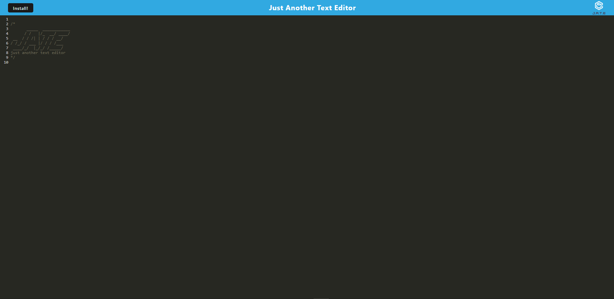
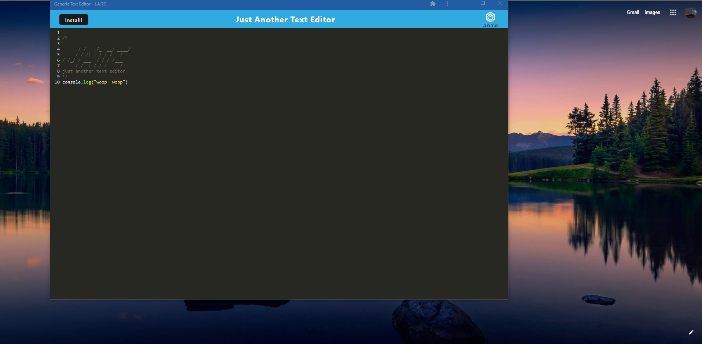

# progressive-web-app 

# Description

This project is a text editor made using web pack following the rules of a progressive web app.

The website deployed to heroku is [here](https://oh-so-progressive.herokuapp.com/).

- Below are images of the web app in heroku.

  

  

## Table of Contents

- [Installation](#installation)
- [Usage](#usage)
- [Credits](#credits)
- [License](#license)

# Installation

Navigate to the folder and open up the integrated terminal. Run `npm i` and all the dependecies will install for you.

# Usage

After installing the dependencies, run
`npm run start`
in the terminal. The app will run in localhost with a port of 3000.

# Contributors

I am currently the lone contributor.

# License

This project uses the MIT license.

# Tests

There are currently no tests for this application so far.

# Questions

Contact me at mohamedfarah0508@gmail.com for any questions.
